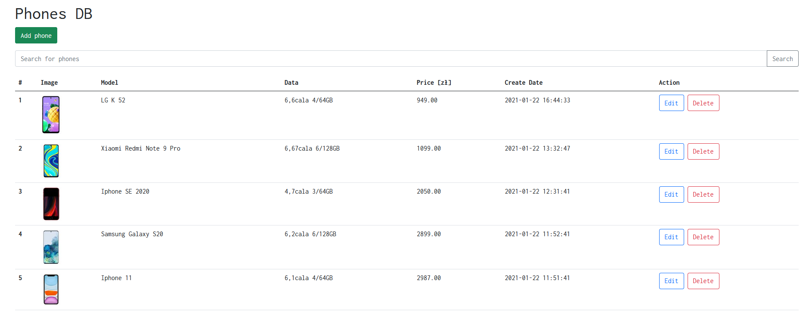

# Phones DB
Phones table with CRUD options realised with PHP, Bootstrap and mySQL. PDO library was used for database connection.

# Requirements
* PHP
* mySQL

# Photos

# Usage
On the top is button for adding new phones to the database. In order to search you can type something in search panel and hit search button. Each phone has buttons to edit and delete. Edition is performed after hitting submit button.
